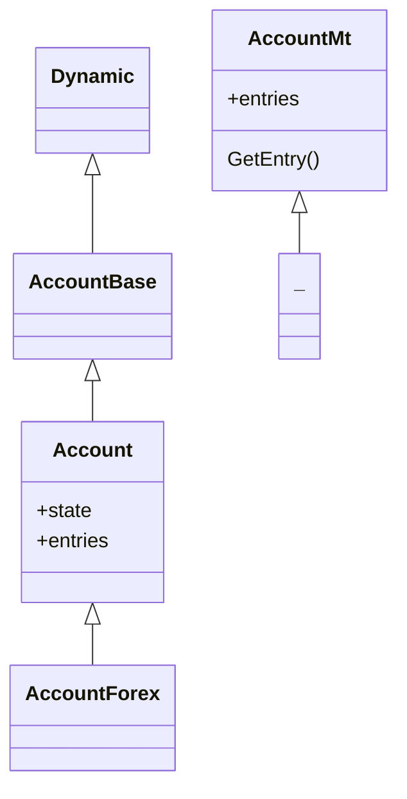

# Account

## Classes



### `Account` class

The class for managing the current trading account.

#### Example 1 - Managing account (dynamic calls)

```cpp
Account *acc = new Account();
double _balance = acc.GetBalance();
double _credit = acc.GetCredit();
double _equity = acc.GetEquity();
double _margin_free = acc.GetMarginFree();
double _margin_used = acc.GetMarginUsed();
if (acc.IsExpertEnabled() && acc.IsTradeAllowed()) {
  // Some trade code.
}
delete acc;
```

#### Example 2 - Managing account (static calls)

```cpp
double _balance = Account::AccountBalance();
double _credit = Account::AccountCredit();
double _equity = Account::AccountEquity();
double _margin_free = Account::AccountFreeMargin();
double _margin_used = Account::AccountMargin();
if (Account::IsExpertEnabled() && Account::IsTradeAllowed()) {
  // Some trade code.
}
```
