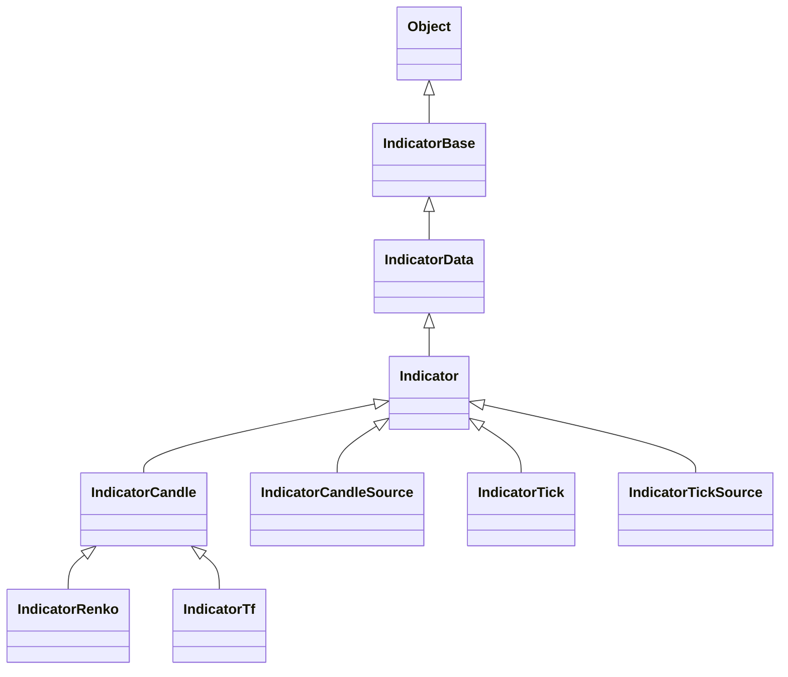

# Indicator

Indicator classes are intended for implementation of technical indicators.

They can help with storing and accessing values and indicator parameters.

## Class diagram



## `IndicatorBase`

An abstract class for all type of indicators (a base class).

### `IndicatorData` class

The purpose of `IndicatorData` class is to store indicator data.
It is basically alternative implementation of `Indicator` class.

For more details, please read:
[Class to hold indicator values]( https://ea31337.github.io/EA31337-classes/issues/23).

For implementation example,
check [`tests/IndicatorDataTest.mq5`](tests/IndicatorDataTest.mq5).

### `GetEntryValue(int _mode, int _abs_shift)` - overridable method

Method must be overriden in any new indicator
and MUST NOT apply shift from `iparams.shift`/`iparams.GetShift()`!
Shift 0 must always point to the value for the current tick.

Returns indicators's value for a given mode and absolute shift
(the shift is directly passed to built-in methods such as iATR(),
 OnCalculate methods such as `iVIDyAOnIndicator()` and also to `iCustom()`).

For `OnCalculate()` methods such as iVIDyAOnIndicator(),
the shift is passed to `return _cache.GetTailValue<double>(_mode, _shift);`
so we can return value calculated in the past
(or just retrieve **DBL_MAX** in case the value was not yet calculated).
Note that `OnCalculate()` methods uses single/multiple price buffers,
e.g., applied price or OHLCs from base indicator.

In scenario of `VIDyA[shift = 2] <- Candle <- TickMt` call hierarchy looks like:

```cpp
- VIDyA::GetEntry(_rel_shift = 1) // Then per each mode:
- entry.values[_mode] = Indicator::GetValue(_mode, _rel_shift = 1)
- VIDyA::GetEntryValue(_mode, _abs_shift = iparams.shift + 1)
- VIDyA::iVIDyAOnIndicator(..., _mode, _shift = 3) then: // Shift is absolute.
- VIDyA::iVIDyAOnArray(..., _mode, _shift = 3) then: // Shift is absolute.
  return _cache.GetTailValue<double>(_mode, _shift = 3); // Shift is absolute.
```

Last line means that we will retrieve **VIDyA** value shifted by 3
(2 from `iparams.shift` + 1 from `GetEntry()`).
It is correct.

### `GetEntryAlter(IndicatorDataEntry &_entry, int _rel_shift)` - overridable method

Shift passed is relative to the shift from `IndicatorParams::shift` (read via `Indicator::iparams.shift`).

Method calls (seen in **MWMFI**, **CCI**, **Envelopes**, **Momentum**, **Pivot**):

```cpp
- GetValue<double>(_mode, _rel_shift) // GetValue<T>() takes relative shift.
```

### `GetValue(int _mode = 0, int _rel_shift = 0)` - non-overridable method

Shift passed is relative to the shift from `IndicatorParams::shift` (read via `Indicator::iparams.shift`).

Method calls:

```cpp
- GetEntryValue(_mode, _abs_shift = iparams.shift + _rel_shift)
```

### `GetEntry(int _rel_shift = 0)` - overridable method

Shift passed is relative to the shift from `IndicatorParams::shift` (read via `Indicator::iparams.shift`).

If you need to access entries from absolute shift, use `GetEntryByAbsShift(int _abs_shift)`.

Note that values accessed via index operator `storage[rel_shift]` e.g.,
inside `OnCalculate()` methods like `double _o = open[rel_shift = 4].Get()`
will take relative shift and retrieve open price shifted by (in this scenario)
`4 + iparams.shift` set in base indicator:

- `double _o = open[_rel_shift = 4]`
- `IndicatorBufferValueStorage::Fetch(_rel_shift = 4)`
- `IndicatorData::GetValue(_mode, _rel_shift = 4)`
- `Indicator::GetEntryValue(_mode, _abs_shift = iparams.shift + 4)`
  // As GetEntryValue() takes absolute shift, we add shift from iparams.shift.
- `Indicator::GetEntry(_rel_shift = _abs_shift - iparams.shift)...`
  // Converting absolute shift into relative one for GetEntry().
- `...[_mode]; // IndicatorDataEntry.values[_mode].Get(...);`

### `GetBarTime(int _rel_shift = 0)`

Shift passed is relative to the shift from `IndicatorParams::shift`
(read via `Indicator::iparams.shift`).

### `GetPrice(ENUM_APPLIED_PRICE _ap, int _rel_shift = 0)`

Shift passed is relative to the shift from `IndicatorParams::shift`
(read via `Indicator::iparams.shift`).

### GetBars()

Number of returned bars is decremented by `IndicatorParams::shift`
(read via `Indicator::iparams.shift`).
Thus if there are **10** bars and *shift* is **8** then `GetBars()` will return **2**.
That means that you can safely do `GetEntry()` for relative shifts **0** or **1**.
There won't be any value in other relative shifts.

### HistoryValueStorage::Fetch(int _rel_shift)

Shift passed is relative to the shift from `IndicatorParams::shift`
(read via `Indicator::iparams.shift`).

### `Indi_*::*OnIndicator(..., _shift, [_shift1], [_shift2])`

All shifts passed are relative to the shift from `IndicatorParams::shift`
(read via `Indicator::iparams.shift`).

### IndiBufferCache::GetValue()/GetTailValue(int _buffer_index, int _shift)

Shift passed may be relative or absolute. It depends on the ValueStorage specialization.

E.g., `HistoryValueStorage` operates on relative shifts,
but `NativeValueStorage` operates on absolute shift,
because it is unaware for which indicator values are stored.

Thus way, `IndiBufferCache::GetValue()` and `IndiBufferCache::GetTailValue()`
also don't know which type of shift was passed.
However, all current indicators uses `NativeValueStorage` for storing indicator values,
so shift passed must is treated as absolute.

In scenario where indicator (shift **2**) has **8** values in the buffer
with  (assuming **10** candles have passed),
`GetEntry(0)` would retrieve cache value from shift

## `Indicator`

An abstract class (subclass of `IndicatorBase`) to implement all type of indicators.

The purpose of `Indicator` class is to provide common functionality
across all indicators such as storing and searching for values.

It implements structure for storing input parameters
and buffer for accessing cached values by a given timestamp.

## `IndicatorCandle`

An abstract class (subclass of `IndicatorBase`) to implement candle indicators.

It aims at managing prices by grouping them into OHLC chart candles.

## `IndicatorRenko`

(to be added)

An abstract class (subclass of `IndicatorCandle`) to implement Renko indicators.

It aims at managing prices by splitting them based solely on price movements.

It can accept `IndicatorTick` as a data source.

## `IndicatorTf`

An abstract class (subclass of `IndicatorCandle`)
to implement timeframe indicators.

It aims at storing prices by grouping them based on standardized time intervals
(e.g. M1, M2, M5).

An instance has information about timeframe.

Information about symbol can be accessed through the tick indicator.

It can accept `IndicatorTick` as a data source.

## `IndicatorTick`

An abstract class (subclass of `IndicatorBase`) to implement tick indicators.

It aims at managing bid and ask prices and can be used as data source.

An instance has information about symbol, but it doesn't have timeframe.
